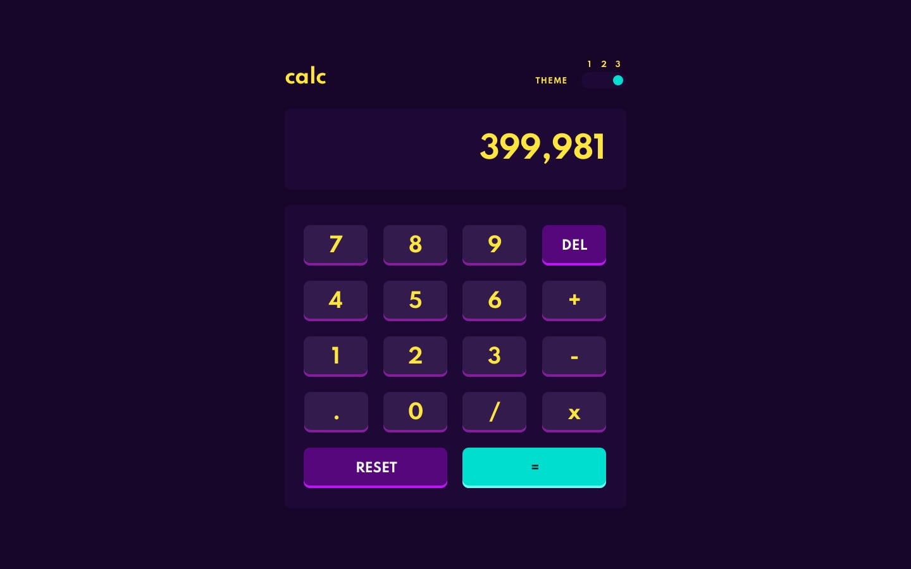

# Calculator App 🧮

A responsive, multi-theme calculator built using **HTML**, **CSS**, and **JavaScript**. Designed to deliver a smooth experience across desktop and mobile devices, this project emphasizes clean design, usability, and accessibility.


---

## 🔗 Live Demo

Experience it live: [calc.gauravrayat.me](https://calc.gauravrayat.me)

---

## 🚀 Features

- 🔢 Basic arithmetic operations: `+`, `−`, `×`, `÷`
- 🎨 Three switchable design themes
- 💻 Desktop + 📱 Mobile responsive layout
- ⌨️ Keyboard input support
- ♻️ Reset & Delete buttons for convenience
- ⚡ Fast and lightweight – no libraries used

---

## 📂 Folder Structure

```
CALCULATOR-APP/
├── css/
│   └── style.css
├── design/
│   ├── desktop-preview.jpg
│   ├── desktop-design-theme-1.jpg
│   ├── desktop-design-theme-2.jpg
│   ├── desktop-design-theme-3.jpg
│   ├── mobile-design-theme-1.jpg
│   ├── mobile-design-theme-2.jpg
│   └── mobile-design-theme-3.jpg
├── images/
│   └── my-avatar.png
├── src/
│   └── calculator.js
└── index.html
```

---

## 🎨 Design Overview

### Desktop Themes

| Theme 1 | Theme 2 | Theme 3 |
|--------|--------|--------|
|  |  |  |

### Mobile Themes

| Theme 1 | Theme 2 | Theme 3 |
|--------|--------|--------|
|  |  |  |

---

## 🧪 How to Run Locally

1. Clone the repository:
   ```bash
   git clone https://github.com/your-username/calculator-app.git
   cd calculator-app
   ```

2. Open `index.html` in your browser.

> ✅ No build tools or frameworks needed.

---

## 📬 Contact

Made with ❤️ by [Gaurav Rayat](https://gauravrayat.me)

- 🌐 [Portfolio](https://gauravrayat.me)
- 📧 [Email](mailto:gaurav.rayat2004@gmail.com)

---

## 📝 License

This project is licensed under the [MIT License](LICENSE).
